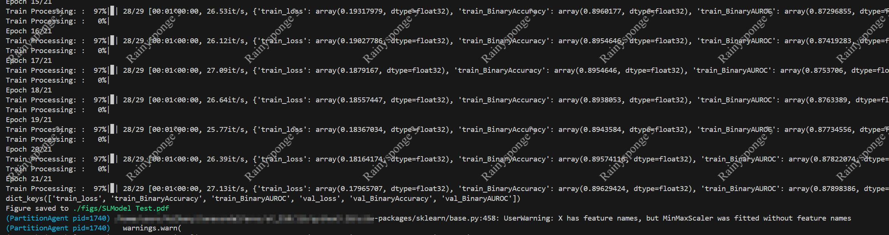

# 基于SecrectFlow进行差分隐私垂直拆分学习

在本实验中,同学们需要使用隐语的privacy.mechanism.torch（也可以按照官方教程使用tensorflow）和 ml.nn.sl模块（新版本其被包含在secretflow_fl中）完成一个分类问题.同学们可以按照下述流程完成实验:
- 熟悉垂直拆分学习的各个参与方的"职责"和机器学习差分隐私的相关机制;
- 使用bank_marketing数据集，按照教程，进行拆分学习训练；
- 在上述步骤的基础上，在训练过程中加入差分隐私相关机制（LabelDP、GaussianEmbeddingDP）；
- 尝试不同的参数，如学习率、隐私预算等等；
- 【选做】实现自定义差分隐私机器学习算法并用其替换SecrectFlow框架内建差分隐私策略进行垂直拆分学习；
- 撰写实验报告.

## 安装隐语

具体可以参考session1中的安装步骤，安装完成后可以通过下面的代码测试是否安装正确

```cmd
[root@localhost SecretFlow-Practice]$ python
Python 3.10.14 (main, May  6 2024, 19:52:50) [GCC 11.2.0] on linux
Type "help", "copyright", "credits" or "license" for more information.
>>> from secretflow.ml.nn.fl.backend.torch.fl_base import BaseTorchModel
>>> 
```

## 使用隐语进行垂直拆分学习

这里请各位同学根据**正确版本号**对应的文档可以尝试补全文件 SL_only.py，同学们可以使用tensorflow（直接按照教程，可能存在问题需要手动修正）也可以使用pytorch，此处也给出了pytorch的相关模型实现，详见 models.py。

数据划分要求为，数据的前4个特征和数据标签有Alice持有，而其余特征有Bob持有。

```cmd
cd session3
python -m SL_only
```

如果代码无误的话，可以得到如下结果：




在实现用可能遇到数据类型错误，这里可以参考 [lia attacks](https://github.com/secretflow/secretflow/blob/main/tests/ml/nn/sl/attack/test_torch_direct_based_scoring_lia.py) 中关于SLModel和相关数据的使用。

进一步，同学们可以尝试调整下学习率，现在是1e-3，可以将其调大调小观察 AUC 和 Loss 等指标的变化。


## 仅Alice参与训练

同学们需要试着修正 SL_only.py 中的内容，让其变成只有Alice参与训练的情况，并尝试运行。具体来说就是删除其中关于Bob的所有内容，并将其保存为 SL_single.py。

```cmd
python -m SL_single
```


## 结合垂直拆分学习和拆分隐私

根据文档中的教学，我们需要在标签持有者Alice上使用LabelDP，在 Bob 上使用 GaussianEmbeddingDP。具体请参考文档的相关实现，补全代码 dp_task.py。此处代码和 SL_only.py 绝大部分是重复的，而引入dp组件只需要短短几行代码，体现了隐语框架的便用性和内部模块的解耦。当然直接运行可能会存在一些问题，该问题出现在LabelDP模块中，因此需要同学们对摘抄自隐语框架的代码 label_dp.py 进行简单地修正。

```cmd
python -m dp_task
```


请同学们尝试不同的超参数，如隐私预算、l2_norm_clip等，并记录结果。

## 【选做】实现自定义差分隐私机器学习算法并用其在隐语框架内进行垂直拆分学习

对于学有余力的同学们可以参考 GaussianEmbeddingDP 尝试实现 DPSGD ，具体就是在fuse model返回梯度时，在梯度数据上加入相关的差分隐私噪声。当然，这个任务也可以考虑使用隐语中的 callback 接口进行实现，具体请参考 [MaxNorm](https://github.com/secretflow/secretflow/blob/main/tests/ml/nn/sl/defenses/test_max_norm.py) 中关于 MaxNorm 的实现。只是 MaxNorm 加入的噪声并不是符合差分要求，需要简单地修正。 


## 撰写实验报告

最后请正确记录相关结果，并注明相关结果对应的是哪部分任务，尽量不要把所有图片截个图放入报告中就上交了，一一核对实在有点辛苦QAQ。如果方便的话，请同学们最好也不要改变文件名，方便检查。当然同学们如果一意孤行，那这边也没有什么办法，还是会仔细查看的...
